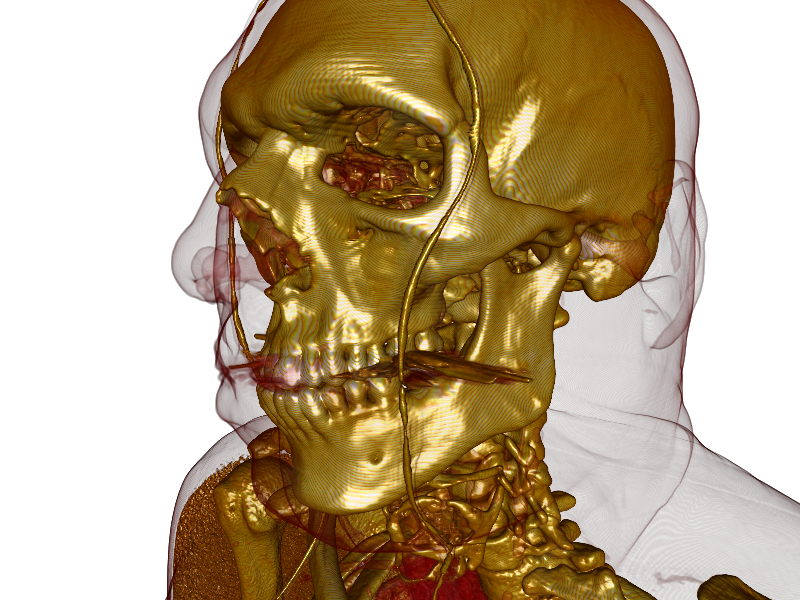
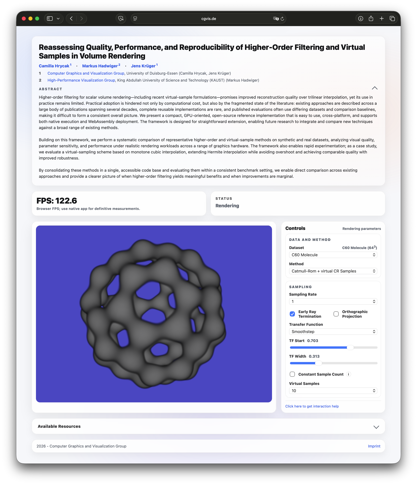

# Raycaster

`Raycaster` is an interactive GPU volume ray casting application used as the companion implementation for the accompanying publication. The project is built to compare classical volume reconstruction methods against virtual sampling variants and prefiltered spline-based approaches under consistent datasets, transfer functions, and camera settings.

The application supports both interactive exploration and scripted evaluation. In addition to a native desktop build, the repository also contains a WebAssembly/WebGL build path and a small browser UI.

If you want to try Raycaster without compiling anything locally, you can use the hosted web version at [cgvis.de/vs](https://www.cgvis.de/vs).

[](https://www.cgvis.de/vs/?dataset=6&method=46&const=0&vs=5&sr=0&tfType=2&tfStart=0.236&tfWidth=0.015&transform=-0.697599113_0.716231883_-0.0191671364_0_0.0649159178_0.0365399681_-0.997222126_0_-0.713542402_-0.696904421_-0.0719851702_0_0_0_0_1%7E0.100000016_-0.199999988_1.30000019&background=1%2C1%2C1%2C1&tfEncoding=UkxFRgAEAAAAAAAA__8B_zUAAQYBDgEZASIBRAFNAVgBYAFvAX0BggGTAaoBvgHSAeAB6wH5uf9FAAEGASoBRAFjAW8BhQGcAbUBxgHdAegB-a__IQABHAEqATsBRwFPAlgDWwFSATsBKAEDDgABGgFwAc7A_w&alpha=0.9900000095367432&ortho=0&level=0)

Click the image above to open this rendering directly in the hosted web viewer.

## What This Repository Contains

- A native OpenGL volume renderer for 3D scalar datasets
- Multiple reconstruction and traversal modes, including:
  - linear reconstruction
  - quadratic and cubic B-spline reconstruction
  - pre-integrated and peak-finding variants
  - prefiltered quadratic and cubic spline volumes
  - virtual sampling with linear, Catmull-Rom, Hermite, and monotone Hermite interpolation
  - lit and unlit render paths
- Built-in synthetic volumes and bundled real datasets
- Scriptable benchmarking and batch image generation
- An Emscripten/WebGL target with a browser-based frontend

## Included Datasets

The repository ships with a small set of representative datasets and synthetic test cases:

- Synthetic: sphere, ramp, Marschner-Lobb
- Real data: aneurism, bonsai, c60, head512, xmas

These are used both for interactive inspection and for the scripted experiment runs in `Raycaster/Scripts/`.

## Build

### Native build

The native application can be built with the provided `makefile` in `Raycaster/`.

Requirements:

- C++20 compiler
- GLFW
- GLEW
- OpenGL

On macOS, the makefile expects Homebrew-style include/library locations for GLFW and GLEW.

Build:

```bash
cd Raycaster
make
```

Release build:

```bash
cd Raycaster
make release
```

The executable is written to:

```text
Raycaster/build/Raycaster
```

The build also copies shaders, datasets, and scripts into the build output directory so the executable can find them at runtime.

### Xcode

An Xcode project is included:

```text
Raycaster.xcodeproj
```

This is the most convenient way to work on the macOS build inside Xcode.

### Web build

If you only want to use Raycaster, you do not need to build the web version locally. A hosted version is available at [cgvis.de/vs](https://www.cgvis.de/vs).

[](https://www.cgvis.de/vs/?dataset=3&method=69&const=0&ortho=0&vs=10&sr=0&tfType=0&tfStart=0.703&tfWidth=0.313&alpha=0.9900000095367432&level=0&transform=0.812195241_0.370474875_0.450651467_0_-0.0432563201_0.808593869_-0.586774647_0_-0.581779897_0.457082629_0.672761619_0_0_0_0_1~0_0_0.600000024)

Click the screenshot above to open the same configuration in the hosted web interface.

The project also supports an Emscripten build:

```bash
cd Raycaster
make emscripten
```

This generates the browser build in:

```text
Raycaster/web/
```

To serve the generated files locally:

```bash
cd Raycaster
python3 server.py
```

or run `python3 Raycaster/server.py` from the repository root.

## Running Raycaster

After building the native version:

```bash
cd Raycaster/build
./Raycaster
```

Raycaster starts with a set of predefined render modes and a list of built-in datasets. Transfer functions, sampling parameters, mip levels, and camera transforms can be changed interactively or through scripts.

## Scripted Evaluation

The application includes a command interpreter and several ready-made experiment scripts:

- `Raycaster/Scripts/quality.gsc`
- `Raycaster/Scripts/performance.gsc`
- `Raycaster/Scripts/scaling.gsc`

These scripts automate:

- dataset selection
- transfer-function setup
- reconstruction method selection
- virtual sampling configuration
- screenshot capture
- FPS logging
- scaling and quality sweeps

This makes the repository suitable both for reproducing figures and for extending the evaluation with additional rendering methods.

## Research Focus

From the implementation and experiment scripts, the main focus of the project is the comparison of:

- baseline ray marching methods
- virtual sampling strategies
- spline-based reconstruction
- prefiltered volume representations
- image-quality and performance tradeoffs

The codebase is therefore not just a viewer, but an experimental platform for studying reconstruction quality, sampling efficiency, and rendering behavior across multiple datasets and settings.
